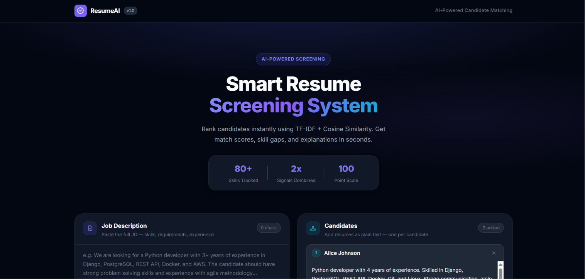
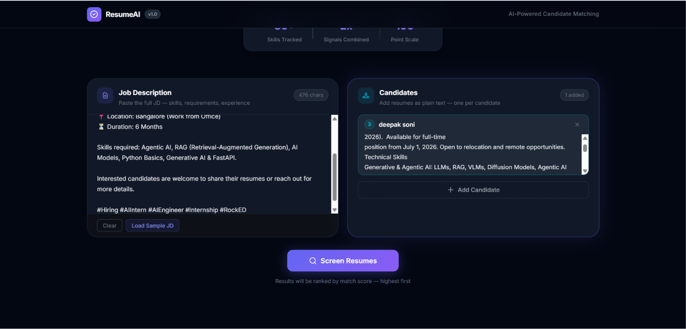
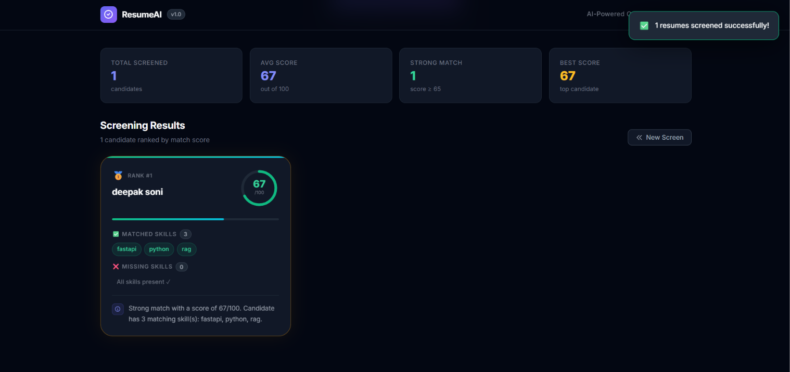

# Smart Resume Screening System (AI-Powered)

## Screenshots

**Homepage — Input Screen**


**Filling Job Description & Candidates**


**Screening Results with Score, Skills & Explanation**


---

A full-stack resume screening system built with **FastAPI** (backend) and **HTML/CSS/JS** (frontend) that takes a Job Description, matches resumes against it, and returns a relevance score with matched skills, missing skills, and a brief explanation.

---

## Project Structure

```
mxpetz/
├── backend/
│   ├── main.py          # FastAPI app with POST /screen endpoint
│   ├── parser.py        # Extracts skills and experience from text
│   ├── matcher.py       # TF-IDF scoring, skill comparison, explanation
│   ├── skills_db.py     # Curated list of 80+ tech and soft skills
│   └── requirements.txt
│
├── frontend/
│   ├── index.html       # UI — open directly in browser
│   ├── style.css        # Dark theme, production-level design
│   └── app.js           # Calls backend API, renders results
│
└── README.md
```

---

## Approach Explanation

### 1. Resume Parsing (Basic)

Resume text and Job Description are scanned against a hand-curated skills database (`skills_db.py`) using **regex word-boundary matching** to extract:

- **Skills** *(mandatory)* — matched from 80+ common tech and soft skills (Python, Docker, React, SQL, Agile, etc.)
- **Experience years** *(optional)* — extracted using patterns like `"3 years of experience"`, `"4+ yrs experience"`

### 2. Matching Logic — TF-IDF + Cosine Similarity

Two signals are combined into a final score:

| Signal | Weight | Purpose |
|---|---|---|
| **Skill Match Ratio** | 60% | Direct comparison of skills found in JD vs resume |
| **TF-IDF Cosine Similarity** | 40% | Captures contextual keyword overlap beyond listed skills |

```
final_score = round((0.6 × skill_score + 0.4 × tfidf_score) × 100)
```

- **TF-IDF** vectorizes both texts using unigrams + bigrams (`ngram_range=(1,2)`)
- **Cosine Similarity** is computed via `scikit-learn`
- Results are **sorted by score** (highest first)

### 3. Output (Must Have)

For each resume, the system returns:

| Field | Description |
|---|---|
| `match_score` | Integer from 0–100 |
| `matched_skills` | Skills present in both JD and resume |
| `missing_skills` | Skills required by JD but absent from resume |
| `explanation` | 2–3 line human-readable summary |

---

## Setup Steps

### Prerequisites

- Python 3.10 or above
- pip

### Step 1 — Clone / Download the project

```bash
cd mxpetz/backend
```

### Step 2 — Install dependencies

```bash
pip install -r requirements.txt
```

---

## How to Run the API

Navigate to the backend folder and start the server:

```bash
cd backend
uvicorn main:app --reload
```

The API will be live at:

```
http://127.0.0.1:8000
```

---

## How to Run the Frontend

Simply open the frontend in your browser:

```
frontend/index.html  →  double-click to open
```

The frontend automatically connects to the backend at `http://localhost:8000`.

> Make sure the backend is running before using the frontend.

---

## API Reference

### `POST /screen`

Matches one or more resumes against a job description.

**Request Body:**
```json
{
  "job_description": "Looking for a Python developer with 3 years of experience in Django, PostgreSQL, REST API, and Docker.",
  "resumes": [
    {
      "name": "Alice",
      "text": "Python developer with 4 years of experience. Skilled in Django, PostgreSQL, REST API, Git, and Linux."
    },
    {
      "name": "Bob",
      "text": "Java developer with 2 years of experience in Spring Boot, MySQL, and Angular."
    }
  ]
}
```

**Response:**
```json
{
  "total_resumes": 2,
  "results": [
    {
      "name": "Alice",
      "match_score": 82,
      "matched_skills": ["django", "postgresql", "python", "rest api"],
      "missing_skills": ["docker"],
      "explanation": "Strong match with a score of 82/100. Candidate has 4 matching skill(s): django, postgresql, python, rest api. Missing key skill(s): docker. Candidate has 4 year(s) of experience, meeting the 3-year requirement."
    },
    {
      "name": "Bob",
      "match_score": 21,
      "matched_skills": ["java", "mysql", "spring boot"],
      "missing_skills": ["django", "docker", "postgresql", "python", "rest api"],
      "explanation": "Weak match with a score of 21/100. Candidate has 3 matching skill(s): java, mysql, spring boot. Missing key skill(s): django, docker, postgresql, python and 1 more. Candidate has 2 year(s) of experience, below the required 3 year(s)."
    }
  ]
}
```

### `GET /`

Health check — confirms the API is running.

---

## Tech Stack

| Layer | Technology |
|---|---|
| Backend | FastAPI, Python 3.10+ |
| Matching | scikit-learn (TF-IDF + Cosine Similarity) |
| Parsing | Python `re` (regex) |
| Frontend | HTML, CSS, Vanilla JS |
| Server | Uvicorn |
